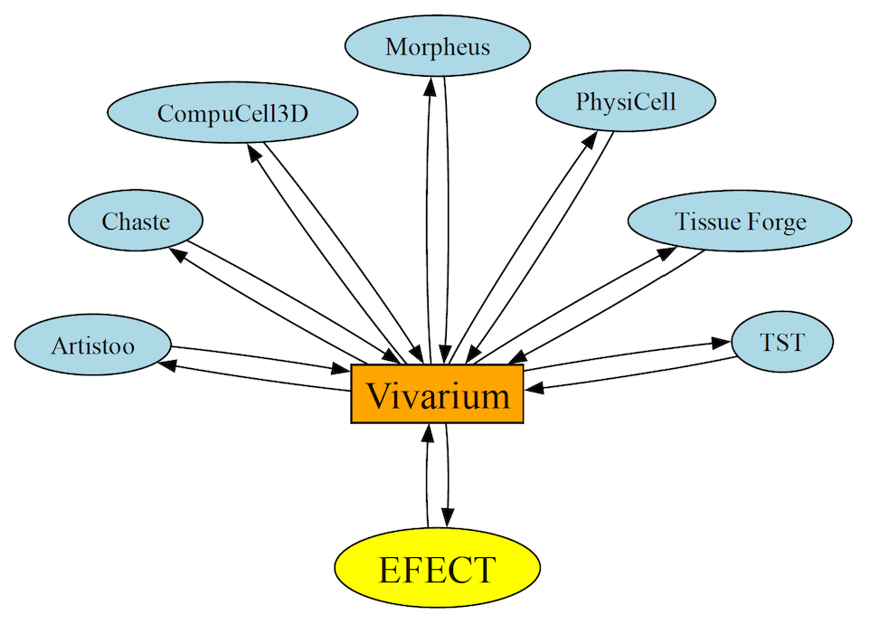

# physicell_vivarium_persistent_cell
Docker image of PhysiCell's *persistent cell* OpenVT reference model. This is primarily intended to be used by Vivarium. When run, it will generate the [desired output](https://github.com/tjsego/PersistentCell/tree/start/experiments/E2/model004/results_raw/physicell) (.csv file) for [EFECT](
https://doi.org/10.48550/arXiv.2406.16820).

A simplified graphical workflow of Vivarium invoking a container for each reference model in each framework and then sending (pairwise?) results to EFECT is shown below:

